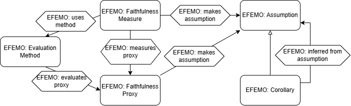
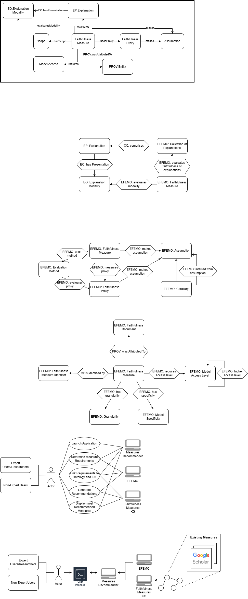
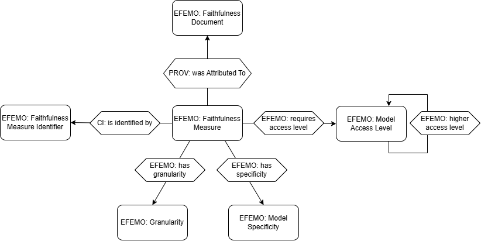

## Conceptual Model

The ontology is centered around the *Faithfulness Measure* concept. Measures use particular methods (the techniques used to determine the faithfulness score) which evaluate a given proxy. The proxy the faithfulness measure actually measures can then be inferred. Additionally, proxies can make assumptions about how faithfulness works. Faithfulness measures as may also make these assumptions. Many of these assumptions are linked to the proxies and faithfulness measures that make them via SWRL rules in the ontology.

Faithfulness measures evaluate collections of explanations (though those collections may only contain one explanation). These explanations have a particular explanation modality, the form it's presented in. This allows the ontology to infer the explanation modality(s) that the faithfulness measure can evaluate.

There are several additional properties associated with faithfulness measures. Measures must be attributed to the document describing it, and must have an associated identifier. Faithfulness measures also have an associated granularity level and model specificity. The amount of model access a faithfulness measure requires is also included. 

## Ontology Files

<table style="width:100%">
    <tr>
        <td>EFEMO base ontology</td>
        <td><a href="https://raw.githubusercontent.com/tetherless-world/faithfulness-measures-ontology/refs/heads/main/resources/efemo.rdf">efemo.rdf</a></td> 
    </tr>
    <tr>
        <td>EFEMO individuals KG</td>
        <td><a href="https://raw.githubusercontent.com/tetherless-world/faithfulness-measures-ontology/refs/heads/main/resources/efemo_indv.rdf">efemo_indv.rdf</a></td> 
    </tr>
</table>

### Reused Ontologies

The explanation faithfulness evaluation measures ontology presented is given the prefix EFEMO. The ontologies reused, and the prefixes used, are shown below:

<table style="width:100%">
    <tr>
        <th>Prefix</th>
        <th>Links</th> 
    </tr>  
    <tr>
        <td>EO</td>
        <td><a href="https://purl.org/heals/eo">Explanation Ontology</a></td> 
    </tr>
    <tr>
        <td>EP</td>
        <td><a href="http://linkedu.eu/dedalo/explanationPattern.owl">Explanation Patterns Ontology</a></td> 
    </tr>
    <tr>
        <td>PROV</td>
        <td><a href="http://www.w3.org/ns/prov-o-20130430">Provenance Ontology</a></td> 
    </tr>
    <tr>
        <td>CC</td>
        <td><a href="https://www.omg.org/spec/Commons/20221101/Collections/">Commons Collections</a></td> 
    </tr>
    <tr>
        <td>CI</td>
        <td><a href="https://www.omg.org/spec/Commons/20221101/Identifiers/">Commons Identifiers</a></td> 
    </tr>
    <tr>
        <td>CD</td>
        <td><a href="https://www.omg.org/spec/Commons/20230801/Documents/">Commons Documents</a></td> 
    </tr>
    <tr>
        <td>AV</td>
        <td><a href="https://www.omg.org/spec/Commons/20221101/AnnotationVocabulary/">Annotation Vocabulary</a></td> 
    </tr>
</table>